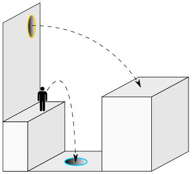

# General

## Game
Portal is a 2007 puzzle-platform game developed and published by Valve.
In this project, a simple version of this game will be developed for the VR experience.

### Description
In Portal the player can set two portals and walk through them. 
This ability allows the player to reach the levels of a room that are otherwise inaccessible to him.
A level corresponds to a room constructed as a puzzle. 
The aim of the game is to cross each room and reach the respective exit.

### Rules
- There are two portals "blue" and "orange". If you go through one, you go through the other. The order does not matter.
- If you place one portal over the other, the lower one disappears.
- If only one portal is placed, you cannot go through it.
- Portals can only be placed on special surfaces.
- The momentum you have when you go through the first portal is maintained when you come out of the second portal.
- If you go through the exit of a room, the level is successfully completed.
- Certain surfaces may not be touched by the player. If this happens, the player is reset to his starting position in the room and all placed portals disappear.

### Out of scope
- Turrets as NPCs
- Movable and draggable Objects
- Controllable oder portable laser
- Multiplayer (Network)
- Keyboard / Mouse support

## Project
This project is being done as part of the GameDev semester at the FFHS.

| project-requirement | place of action |rating |
| ---- | ---- | ---- |
| linear algebra | portal-guns | ✅ |
| 2D or 3D graphics | room | ✅ |
| AI | Sentry Turrets | ❌ |
| locomotion | movement, collision, momentum | ✅ |
| user interface | start-screen, choose level, exit | ✅ |
| distributed games | networking | ❌ |

### Organisation

| Role | Name |
| ---- |----|
| Developer / Project Manager |Luca Hostettler|
| Developer / Project Manager | Sarah Hasler |

### Management

[Link to Todo](./02_project-management.md)
